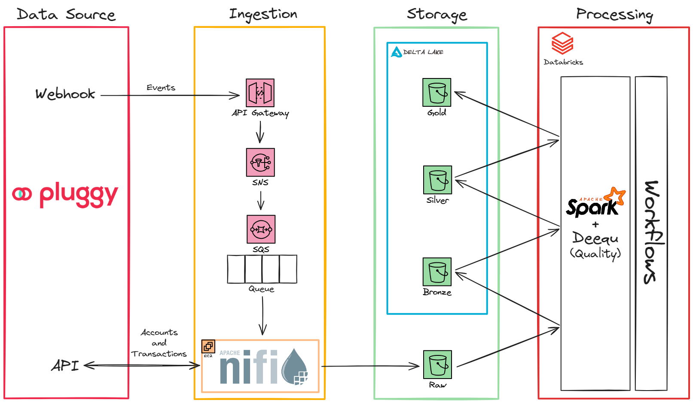

# Unlocking the Power of Open Finance: Building an End-to-End Data Pipeline with AWS, NiFi and Databricks for Custom Financial Solutions

The evolution of Open Finance in Brazil has motivated the emergence of solutions called "financial aggregators". These solutions enable, among other functionalities, the consolidation of the customer financial data, which are scattered across different financial institutions. Additionally, these solutions will foster the increasing use of Artificial Intelligence to provide insights, enhance customer experience, and assist in managing financial life.

Considering this, the purpose of this project is to illustrate the importance of the Data Engineering role in these solutions by building a data pipeline that will collect, store, process, and make available the financial data (accounts, credit cards, and transactions) from different bank accounts.

Due to its complexity, this project has been explained in detail in a series of 4 articles which can be accessed below:

1. [Part I: Introduction](https://medium.com/@viniaperes/desbloqueando-o-poder-do-open-finance-construindo-um-pipeline-de-dados-de-ponta-a-ponta-com-aws-1c5a8c407a65)
2. Part II: Webhook (coming soon)
3. Part III: Ingestion (coming soon)
4. Part IV: Processing (coming soon)

## Data Architecture

